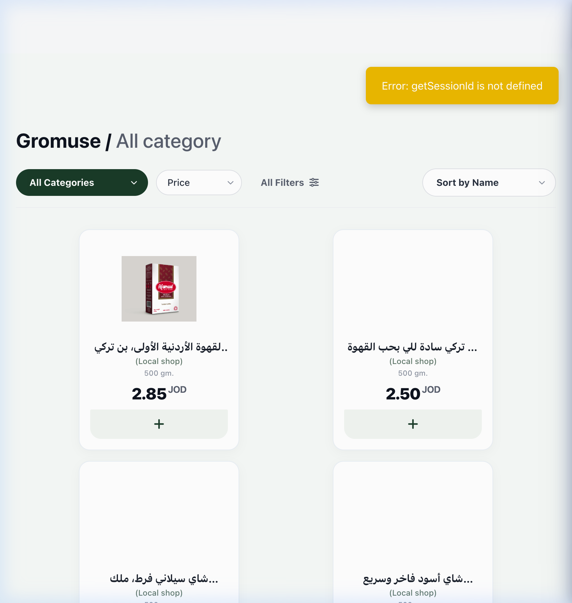

# 🛒 Mooneh.ai - Smart Shopping Assistant

<div align="center">


**مساعد التسوق الذكي للمملكة الأردنية** | **Intelligent Shopping Assistant for the Hashemite Kingdom of Jordan**

Transform your event planning with AI-powered shopping lists tailored specifically for the Jordanian market.

[Features](#-features) • [Installation](#-installation) • [Usage](#-usage) • [API](#-api-reference) • [Contributing](#-contributing)

</div>

---

## 📋 Table of Contents

- [Overview](#-overview)
- [Features](#-features)
- [Technology Stack](#-technology-stack)
- [Installation](#-installation)
- [Configuration](#-configuration)
- [Usage](#-usage)
- [API Reference](#-api-reference)
- [Project Structure](#-project-structure)
- [Contributing](#-contributing)
- [License](#-license)

---

## 🎯 Overview

**Mooneh.ai** is an intelligent shopping assistant web application designed specifically for the Jordanian market. It uses AI-powered natural language processing to help users create smart shopping lists for events like BBQs, dinner parties, family gatherings, and more.

### Key Highlights

- 🤖 **AI-Powered**: Uses Hugging Face AI for natural language understanding in both Arabic and English
- 🏪 **Real Products**: Integrates with Talabat Jordan with real prices in JOD (Jordanian Dinars)
- 💰 **Budget Optimization**: Intelligent budget allocation across product categories
- 🌍 **Bilingual Support**: Fully supports Arabic and English with seamless language switching
- 📱 **Responsive Design**: Works perfectly on desktop, tablet, and mobile devices
- 🔥 **Smart Recommendations**: Context-aware product suggestions based on event type

---

## 📸 Screenshots

### Products Interface & AI Assistant


---

## ✨ Features

### 🧠 AI-Powered Shopping Lists
- Natural language input - just describe what you need
- Smart Shopping Planner form for detailed event planning
- Automatic budget calculation based on event type and number of people
- Intelligent product selection prioritizing essential items (e.g., meat, chicken, shish for BBQ events)

### 🛍️ Product Management
- Browse 100+ products from local Jordanian stores
- Product pagination (12 products per page)
- Advanced filtering by category, price, dietary preferences
- Search products by name (Arabic/English)
- Detailed product information with nutrition facts
- Toggle nutrition information visibility

### 💵 Budget Intelligence
- Set custom budgets or use automatic calculation
- Category-based budget allocation (e.g., 35% meat for BBQ events)
- Strict budget adherence - products selected to maximize budget utilization
- Real-time price calculations in JOD

### 🌐 Internationalization (i18n)
- Complete Arabic and English translations
- Dynamic language switching
- Right-to-left (RTL) layout support for Arabic
- Culturally appropriate product names and descriptions

### 🎨 Modern UI/UX
- Beautiful gradient hero section with background images
- Dark mode support
- Smooth animations and transitions
- Responsive grid layouts
- Interactive shopping cart sidebar
- Wishlist functionality
- Toast notifications for user feedback

### 🍖 Event-Specific Intelligence
- **BBQ Events**: Prioritizes chicken, meat, shish/kebab, charcoal
- **Dinner Parties**: Balanced selection of meat, vegetables, bread, dairy
- **Breakfast**: Focus on bread, dairy, eggs, fruits
- **Lunch Gatherings**: Mix of proteins, vegetables, and sides

---

## 🛠️ Technology Stack

### Backend
- **Node.js** - JavaScript runtime
- **Express.js** - Web framework
- **MongoDB** - Database for products and cart data
- **Hugging Face API** - AI text generation (Mistral-7B-Instruct)
- **Axios** - HTTP client for API requests

### Frontend
- **HTML5** - Semantic markup
- **CSS3** - Modern styling with CSS variables
- **Vanilla JavaScript** - No framework dependencies
- **Font Awesome** - Icon library
- **Google Fonts** - Inter, Space Grotesk, Cairo fonts

### Tools & Services
- **dotenv** - Environment variable management
- **nodemon** - Development auto-reload
- **CORS** - Cross-origin resource sharing

---

## 📦 Installation

### Prerequisites

- **Node.js** 18+ ([Download](https://nodejs.org/))
- **MongoDB** (Optional - falls back to JSON if not available)
- **Git** ([Download](https://git-scm.com/))

### Clone the Repository

```bash
git clone https://github.com/MahmoudEsawi/shopai-jordan.git
cd shopai-jordan
```

### Install Dependencies

```bash
npm install
```

### Environment Setup

Create a `.env` file in the root directory:

```env
# Server Configuration
PORT=3000

# MongoDB Configuration (Optional)
MONGODB_URI=mongodb://localhost:27017/shopai

# Hugging Face AI Configuration
HUGGINGFACE_API_KEY=your_huggingface_api_key_here
```

> **Note**: Get your Hugging Face API key from [huggingface.co/settings/tokens](https://huggingface.co/settings/tokens)

### Run the Application

**Development Mode** (with auto-reload):
```bash
npm run dev
```

**Production Mode**:
```bash
npm start
```

The application will be available at `http://localhost:3000`

---

## ⚙️ Configuration

### MongoDB Setup (Optional)

If you want to use MongoDB for product storage:

1. Install MongoDB locally or use MongoDB Atlas
2. Update `MONGODB_URI` in `.env`
3. Create a database named `shopai`
4. Create a collection named `prouducts` (note the spelling)
5. Import products into the collection

The application will automatically fall back to JSON files if MongoDB is not available.

### Product Data Structure

Products should have the following structure:

```json
{
  "_id": "product_id",
  "name": "Product Name",
  "name_ar": "اسم المنتج",
  "name_en": "Product Name",
  "price": 10.50,
  "currency": "JOD",
  "category": "meat",
  "description": "Product description",
  "store_name": "Store Name",
  "product_url": "https://talabat.com/product-url",
  "image_url": "https://example.com/image.jpg",
  "calories_per_100g": 250,
  "protein_per_100g": 20,
  "carbs_per_100g": 5,
  "fats_per_100g": 15,
  "is_gluten_free": false,
  "is_vegetarian": false,
  "is_vegan": false,
  "is_halal": true,
  "is_organic": false,
  "is_healthy": true
}
```

---

## 🚀 Usage

### Smart Shopping Planner

1. Navigate to the **Smart Shopping Planner** section
2. Select event type (BBQ, Dinner, Lunch, Breakfast, Party)
3. Enter number of people
4. Set budget (optional - will auto-calculate if not specified)
5. Choose dietary preferences (Vegetarian, Vegan, Halal, etc.)
6. Add any additional requests
7. Click "Create Shopping List"

### Chat with AI Assistant

Simply type your request in natural language:

**Examples:**
- "أريد شواء لـ 14 شخص بميزانية 50 دينار"
- "I want a BBQ for 10 people with a budget of 40 JOD"
- "بدي فطور لـ 5 أشخاص"
- "I need chicken and meat for BBQ"

The AI will:
- Understand your request
- Search for relevant products
- Create a smart shopping list
- Calculate quantities based on number of people
- Optimize for your budget

### Browse Products

- Use filters to find products by category, price, dietary preferences
- Search by product name (supports Arabic and English)
- View detailed product information
- Add products directly to cart
- Save products to wishlist

### Shopping List Management

- Edit quantities before adding to cart
- Remove items from list
- View total cost in real-time
- Add entire list to cart with one click
- Clear list and start over

---

## 📡 API Reference

### Get Products

```http
GET /api/products
```

**Query Parameters:**
- `category` - Filter by category
- `search` - Search products by name
- `minPrice` - Minimum price filter
- `maxPrice` - Maximum price filter
- `store` - Filter by store name

**Response:**
```json
[
  {
    "id": "product_id",
    "name": "Product Name",
    "name_ar": "اسم المنتج",
    "price": 10.50,
    "currency": "JOD",
    "category": "meat",
    ...
  }
]
```

### Chat with AI

```http
POST /api/chat
```

**Request Body:**
```json
{
  "message": "أريد شواء لـ 10 أشخاص",
  "eventType": "bbq",
  "numPeople": 10,
  "budget": 70,
  "dietary": "halal",
  "filterHealthy": false,
  "filterGlutenFree": false,
  "fromSmartPlanner": true
}
```

**Response:**
```json
{
  "response": "AI response message",
  "shopping_list": {
    "items": [...],
    "total_cost": 68.50,
    "num_people": 10,
    "event_type": "bbq"
  },
  "relevantProducts": [...]
}
```

### Cart Operations

```http
GET /api/cart
POST /api/cart/add
POST /api/cart/remove
POST /api/cart/update
```

### Statistics

```http
GET /api/stats
```

Returns product categories, stores, and general statistics.

---

## 📁 Project Structure

```
shopai-jordan/
├── server.js                 # Main Express server
├── package.json              # Dependencies and scripts
├── .env                      # Environment variables (not in git)
├── .gitignore               # Git ignore rules
│
├── static/                  # Static assets
│   ├── css/
│   │   ├── style.css        # Main stylesheet
│   │   ├── cart-sidebar.css
│   │   ├── darkmode.css
│   │   └── ...
│   └── js/
│       ├── main.js          # Main JavaScript logic
│       ├── translations.js  # i18n translations
│       ├── wishlist.js
│       └── ...
│
├── templates/
│   └── index.html           # Main HTML template
│
├── data/                    # Data files
│   └── jordan_products.json # Product data fallback
│
└── background/              # Background images
    └── Gemini_Generated_Image_sxgg5bsxgg5bsxgg.png
```

---

## 🎨 Key Features Explained

### Intelligent Product Selection

The system uses advanced algorithms to select products based on:

1. **Event Type Priority**: Different events require different product priorities
   - BBQ: Meat (chicken, beef, lamb), Shish/Kebab, Charcoal
   - Dinner: Meat, Vegetables, Bread, Dairy
   - Breakfast: Bread, Dairy, Eggs, Fruits

2. **Budget Allocation**: Smart category-based budget distribution
   - BBQ events: 35% meat, 15% vegetables, 15% drinks, etc.
   - Ensures balanced shopping lists within budget

3. **Essential Products First**: Always includes essential items
   - For BBQ: Chicken, Meat, Shish are mandatory
   - Searches by keywords if category classification is incorrect

### Language Support

Full bilingual support with:
- Dynamic language switching (AR ↔ EN)
- RTL layout for Arabic
- Translated product names, categories, UI elements
- Cultural context awareness

### Budget Intelligence

- **Automatic Calculation**: Calculates realistic budgets based on event type and number of people
- **Jordanian Market Prices**: Tailored to local market prices (7 JOD/person for BBQ)
- **Strict Adherence**: Products selected to maximize budget utilization (98% usage)
- **Category Allocation**: Distributes budget across categories intelligently

---

## 🤝 Contributing

Contributions are welcome! Please feel free to submit a Pull Request.

### Contribution Guidelines

1. Fork the repository
2. Create a feature branch (`git checkout -b feature/AmazingFeature`)
3. Commit your changes (`git commit -m 'Add some AmazingFeature'`)
4. Push to the branch (`git push origin feature/AmazingFeature`)
5. Open a Pull Request

### Development Setup

```bash
# Install dependencies
npm install

# Run in development mode
npm run dev

# Run with file watching
npm run dev:watch
```

---

## 📝 License

This project is licensed under the MIT License - see the [LICENSE](LICENSE) file for details.

---

## 🙏 Acknowledgments

- **Hugging Face** - For providing AI models and API
- **Talabat Jordan** - For product data and integration inspiration
- **Font Awesome** - For beautiful icons
- **Google Fonts** - For typography

---

## 📞 Contact & Support

- **GitHub**: [@MahmoudEsawi](https://github.com/MahmoudEsawi)
- **Repository**: [shopai-jordan](https://github.com/MahmoudEsawi/shopai-jordan)

---

## 🔮 Future Enhancements

- [ ] User authentication and accounts
- [ ] Save shopping lists to user profile
- [ ] Recipe suggestions based on shopping list
- [ ] Direct integration with Talabat ordering API
- [ ] Price comparison across stores
- [ ] Seasonal product recommendations
- [ ] Meal planning calendar
- [ ] Nutritional analysis and health insights

---

<div align="center">

**Made with ❤️ for the Jordanian market**

⭐ Star this repo if you find it helpful!

</div>

